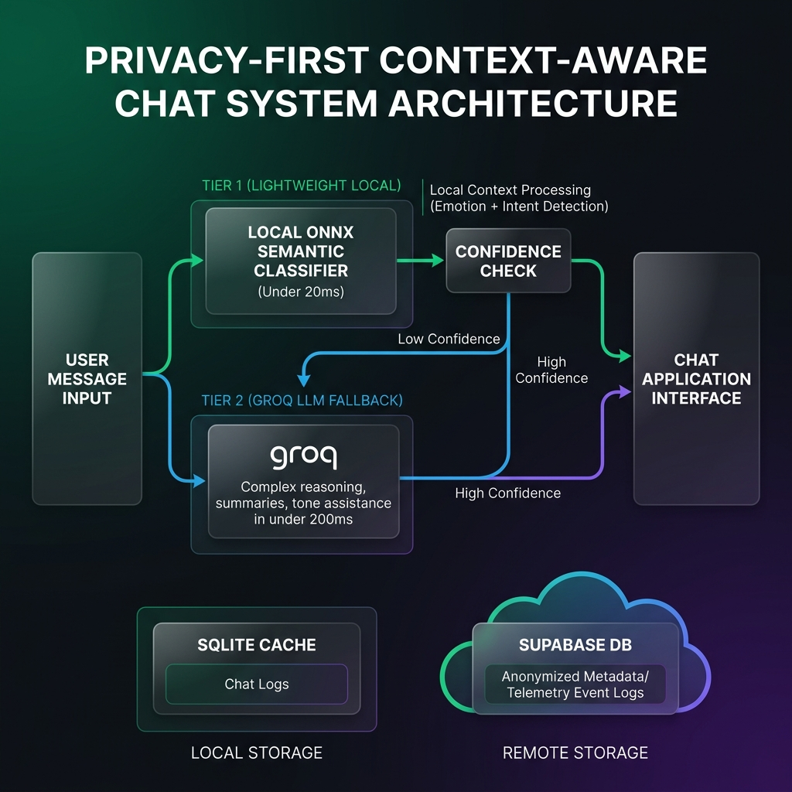
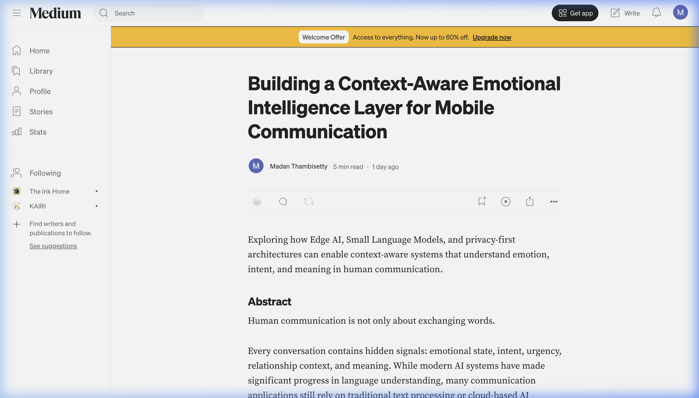

# CIRVA AI Architecture

A privacy-focused context-aware AI communication system exploring:

- Edge AI inference
- ONNX Runtime
- MiniLM emotion + intent detection
- Groq LLM reasoning
- Privacy-first telemetry

## Architecture

### System Architecture

### AI Inference & Fallback Pipeline

### Mobile Application Core Interface

### Telemetry & Analytics Dashboard

## Live Telemetry Report

* **Live Database Metrics Report**: [docs/metrics-report.md](docs/metrics-report.md)
* **Version History & Releases Report**: [docs/releases.md](docs/releases.md)

## Technical Article

Medium:
[Building a Context-Aware Emotional Intelligence Layer for Mobile Communication](https://medium.com/@app_32420/building-a-context-aware-emotional-intelligence-layer-for-mobile-communication-3914de10e528?sharedUserId=app_32420)

Dev.to:
[Building a Context-Aware Emotional Intelligence Layer for Mobile Communication](https://dev.to/madan_thambisetty_/building-a-context-aware-emotional-intelligence-layer-for-mobile-communication-45ki)

## Recognition / Publications

- Technical article: [Building a Context-Aware Emotional Intelligence Layer for Mobile Communication](https://dev.to/madan_thambisetty_/building-a-context-aware-emotional-intelligence-layer-for-mobile-communication-45ki)
- Architecture documentation: [CIRVA AI Architecture Overview Docs](README.md)

## Stack

AI:
- MiniLM
- ONNX Runtime
- Groq

Mobile:
- React Native
- TypeScript

Backend:
- Supabase
- SQLite
