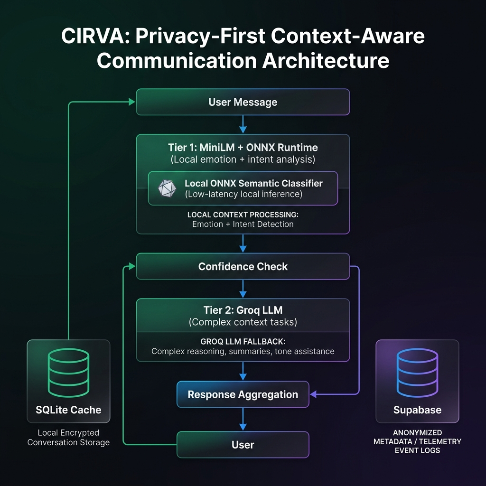

# CIRVA AI Architecture

A privacy-focused context-aware AI communication system exploring:

- Edge AI inference
- ONNX Runtime
- MiniLM emotion + intent detection
- Groq LLM reasoning
- Privacy-first telemetry

## Architecture

## Technical Article

Medium:
[Building a Context-Aware Emotional Intelligence Layer for Mobile Communication](https://medium.com/@app_32420/building-a-context-aware-emotional-intelligence-layer-for-mobile-communication-3914de10e528?sharedUserId=app_32420)

Dev.to:
[Building a Context-Aware Emotional Intelligence Layer for Mobile Communication](https://dev.to/madan_thambisetty_/building-a-context-aware-emotional-intelligence-layer-for-mobile-communication-45ki)

## Stack

AI:
- MiniLM
- ONNX Runtime
- Groq

Mobile:
- React Native
- TypeScript

Backend:
- Supabase
- SQLite
