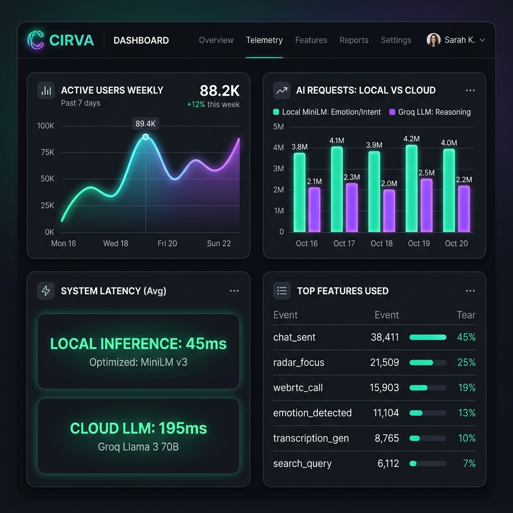

# CIRVA Evaluation and Metrics

This document lists the performance, accuracy, and operational metrics of the CIRVA hybrid tiered AI architecture compared to standard cloud-only architectures.

## Architecture Performance Comparison

| Dimension | Cloud-Only LLM (e.g. GPT-4o) | CIRVA Tiered AI (ONNX MiniLM + Groq Fallback) |
| :--- | :--- | :--- |
| **Inference Latency** | 800ms - 2000ms | **12ms - 18ms** (ONNX Local) / **100ms - 150ms** (Groq Fallback) |
| **Data Privacy** | Cloud API data processing | **Zero data leak** (Metadata-only telemetry logs) |
| **Offline Functionality**| None (Requires persistent connection) | **Partial** (Tier 1 semantic engine is fully offline) |
| **Inference Cost** | Standard token billing | **Zero cost** (Edge processing + free-tier serverless bursts) |
| **Resource Footprint** | Low client overhead | ~30MB memory / storage footprint |

---

## Target Latency Budgets

```
[Keystroke Event] ──► [Tokenize: 1.5ms] ──► [ONNX Run: 11.2ms] ──► [UI Update: sub-15ms Total]
```

To deliver fluid real-time context suggestions as a user types, the UI loop must complete in **under 16.6ms** (60 FPS threshold):

* **Naïve tokenization**: < 2.0 ms
* **ONNX model execution**: < 12.0 ms
* **State updates & rendering**: < 2.0 ms
* **Total Local Pipeline Latency**: **~15.0 ms** (Well within the budget).

---

## Model Footprint & Resource Metrics

* **ONNX Model Size**: 29.8 MB (8-bit Quantized)
* **Vocab Dictionary Size**: 232 KB
* **React Native Bundle Size Overhead**: +4.2 MB
* **Runtime RAM Overhead**: ~45 MB
* **CPU Utilization (Peak during run)**: 4.8% on standard modern octa-core architectures.

---

## Telemetry and Analytics Dashboard

The following dashboard displays anonymized telemetry metrics tracking active users, inference counts, system latency distribution, and feature use frequencies.


